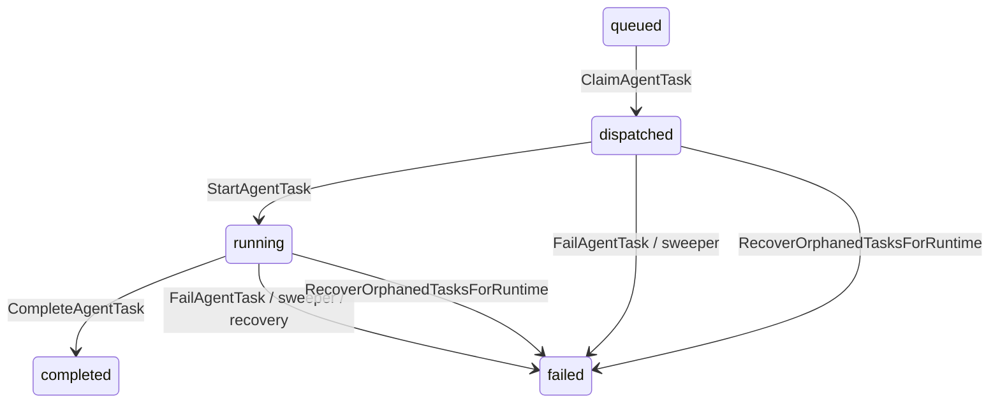
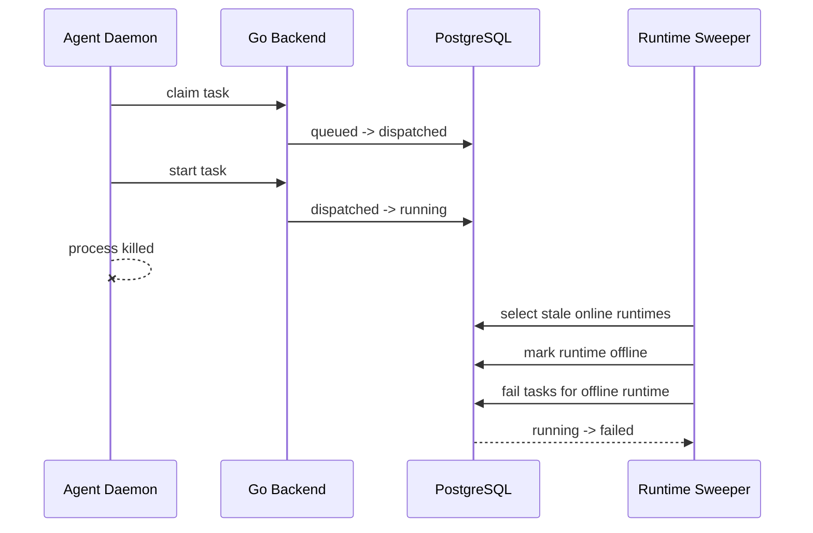
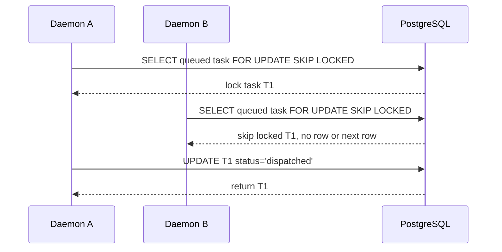

# 任务一 1.2：故障场景推演

本文基于 Multica commit `45dae3185f01cdcd60967df82ca12c16917e566a` 进行源码分析，重点完成场景 A 和场景 B，并补充场景 C 的一致性分析。

## 场景 A：Agent 崩溃时的任务泄漏

### A.1 代码追踪路径

#### 任务正常执行路径

```text
server/cmd/server/router.go:505
  POST /api/daemon/runtimes/{runtimeId}/tasks/claim
server/internal/handler/daemon.go:1159
  Handler.ClaimTaskByRuntime
server/internal/service/task.go:1009
  TaskService.ClaimTaskForRuntime
server/pkg/db/queries/agent.sql:266
  ClaimAgentTask: queued -> dispatched

server/cmd/server/router.go:513
  POST /api/daemon/tasks/{taskId}/start
server/internal/handler/daemon.go:1873
  Handler.StartTask
server/pkg/db/queries/agent.sql:324
  StartAgentTask: dispatched -> running

server/cmd/server/router.go:516
  POST /api/daemon/tasks/{taskId}/complete
server/internal/handler/daemon.go:1974
  Handler.CompleteTask
server/internal/service/task.go:1190
  TaskService.CompleteTask
server/pkg/db/queries/agent.sql:351
  CompleteAgentTask: running -> completed

server/cmd/server/router.go:517
  POST /api/daemon/tasks/{taskId}/fail
server/internal/handler/daemon.go:2144
  Handler.FailTask
server/internal/service/task.go:1373
  TaskService.FailTask
server/pkg/db/queries/agent.sql:416
  FailAgentTask: dispatched/running/waiting_local_directory -> failed
```

#### Daemon 离线感知路径

```text
server/cmd/server/router.go:500
  POST /api/daemon/heartbeat
server/internal/handler/daemon.go:745
  Handler.DaemonHeartbeat
server/internal/handler/daemon.go:868
  Handler.HandleDaemonWSHeartbeat
server/internal/handler/daemon.go:948
  processHeartbeat

server/cmd/server/runtime_sweeper.go:65
  runRuntimeSweeper
server/cmd/server/runtime_sweeper.go:93
  sweepStaleRuntimes
server/pkg/db/queries/runtime.sql:182
  FailTasksForOfflineRuntimes
```

#### 崩溃恢复路径

```text
server/pkg/db/queries/agent.sql:446
  RecoverOrphanedTasksForRuntime
  将该 runtime 之前持有的 dispatched/running/waiting_local_directory 任务标记为 failed
```

### A.2 状态图



### A.3 问题回答

#### 1. 后端如何感知 Agent 离线？

后端通过 runtime heartbeat 感知 daemon 是否在线。HTTP 入口为 `router.go:500` 的 `/api/daemon/heartbeat`，WebSocket 侧有 `HandleDaemonWSHeartbeat`。后台定时任务 `runtime_sweeper.go:65` 每 30 秒检查一次 runtime 是否超过心跳阈值。

`runtime_sweeper.go:22-31` 注释说明 stale 阈值为 150 秒，考虑了 heartbeat 写入批处理和 DB 延迟。`sweepStaleRuntimes` 会先查找 stale online runtime，再结合 liveness store 过滤，最后调用 `MarkRuntimesOfflineByIDs` 标记 offline。

#### 2. 正在执行的任务会经历什么状态变迁？

正常状态是：

```text
queued -> dispatched -> running -> completed/failed
```

如果 daemon 被 kill：

- 若任务已经 `dispatched` 但还没 `start`，会停在 `dispatched`。
- 若任务已经 `running`，会停在 `running`。
- 后端 sweeper 将 runtime 标记 offline 后，会调用 `FailTasksForOfflineRuntimes` 把该 runtime 的活跃任务转为 `failed`。
- daemon 重启时，`RecoverOrphanedTasksForRuntime` 也会把旧 runtime 拥有的 `dispatched/running/waiting_local_directory` 任务转为 `failed`，作为第二道恢复机制。

#### 3. 是否存在任务永久卡在 running 状态的可能？

从当前代码看，不应永久卡住。依据：

1. `runtime_sweeper.go:65-88` 持续运行，周期性执行 `sweepStaleRuntimes` 和 `sweepStaleTasks`。
2. `runtime_sweeper.go:153-160` 在 runtime offline 后调用 `FailTasksForOfflineRuntimes` 清理孤儿任务。
3. `runtime_sweeper.go:241-261` 的 `sweepStaleTasks` 会调用 `FailStaleTasks` 清理超过阈值的 `dispatched/running` 任务。
4. `agent.sql:462-476` 中 `FailStaleTasks` 明确把超时的 `dispatched` 和 `running` 任务更新为 `failed`。
5. `agent.sql:446-460` 的 `RecoverOrphanedTasksForRuntime` 覆盖 daemon 重启场景。

因此结论是：短时间内会卡在 `running`，但不会永久卡住。最坏情况下取决于 stale heartbeat 阈值、sweeper 周期和 running timeout。

### A.4 时序图



### A.5 修复建议

当前机制已经覆盖主要泄漏场景。可优化项：

- 将 running timeout 从全局常量升级为 runtime/task 级配置。
- 在 task row 中记录 `last_task_heartbeat_at`，用任务级心跳判断卡死，而不仅依赖 `started_at`。
- 在 UI 中展示“因 runtime offline 自动失败”的明确原因，降低用户困惑。

关键 diff 思路：

```diff
+ ALTER TABLE agent_task_queue ADD COLUMN last_task_heartbeat_at timestamptz;
+ UPDATE agent_task_queue SET last_task_heartbeat_at = now()
+ WHERE id = $1 AND status = 'running';
```

## 场景 B：并发任务分配的竞态条件

### B.1 代码追踪路径

```text
server/cmd/server/router.go:505
  POST /api/daemon/runtimes/{runtimeId}/tasks/claim
server/internal/handler/daemon.go:1159
  Handler.ClaimTaskByRuntime
server/internal/service/task.go:1009
  TaskService.ClaimTaskForRuntime
server/internal/service/task.go:937
  TaskService.ClaimTask
server/pkg/db/queries/agent.sql:266
  ClaimAgentTask
```

核心 SQL：

```sql
UPDATE agent_task_queue
SET status = 'dispatched', dispatched_at = now()
WHERE id = (
    SELECT atq.id FROM agent_task_queue atq
    WHERE atq.agent_id = $1 AND atq.status = 'queued'
    ORDER BY atq.priority DESC, atq.created_at ASC
    LIMIT 1
    FOR UPDATE SKIP LOCKED
)
RETURNING *;
```

实际 SQL 还包含 `NOT EXISTS` 条件，用于防止同一 agent 对同一 issue/chat/quick-create 同时运行多个任务。

### B.2 并发控制机制

并发控制主要有三层：

1. `TaskService.ClaimTask` 先读取 agent 的 `max_concurrent_tasks`，统计当前 running 数量，超过上限则不领取。
2. `ClaimAgentTask` 使用单条 `UPDATE ... SELECT ... FOR UPDATE SKIP LOCKED` 原子领取任务。
3. `ClaimAgentTask` 内部用 `NOT EXISTS` 排除同一 agent 已经处于 `dispatched/running/waiting_local_directory` 的同源任务。

### B.3 是否可能同一个 Task 被分配给两个 Agent？

在当前实现中，同一条 `agent_task_queue` row 不应被两个 claim 请求同时领取。原因是候选行在子查询里被 `FOR UPDATE SKIP LOCKED` 锁住；第一个事务锁住后，第二个并发事务会跳过该行，不能拿到同一个 id。外层 `UPDATE` 和内层选择在同一 SQL 语句中完成，也避免了“先 SELECT 后 UPDATE”的应用层窗口。

### B.4 时序图



### B.5 如果没有锁会怎样？

如果实现是：

```text
SELECT id FROM agent_task_queue WHERE status='queued' LIMIT 1;
UPDATE agent_task_queue SET status='dispatched' WHERE id = selected_id;
```

则可能出现：

```text
T0: Agent A SELECT 得到 T1
T1: Agent B SELECT 也得到 T1
T2: Agent A UPDATE T1 dispatched
T3: Agent B UPDATE T1 dispatched
T4: 两个 Agent 都认为自己领取成功
```

当前实现通过数据库行锁避免了这个竞态。

### B.6 测试方案

建议新增 Go 并发测试：

1. 准备一个 `queued` 任务。
2. 并发启动 20 个 goroutine 同时调用 `ClaimTaskForRuntime` 或 `ClaimTask`。
3. 统计成功返回 task 的数量必须为 1。
4. 查询 DB，确认该 task 状态为 `dispatched`，且没有重复任务被创建。

伪代码：

```go
var wg sync.WaitGroup
results := make(chan string, 20)
for i := 0; i < 20; i++ {
    wg.Add(1)
    go func() {
        defer wg.Done()
        task, _ := svc.ClaimTask(ctx, agentID)
        if task != nil {
            results <- util.UUIDToString(task.ID)
        }
    }()
}
wg.Wait()
close(results)
require.Len(t, results, 1)
```

## 场景 C：WebSocket 重连后的状态一致性

### C.1 代码追踪路径

```text
server/internal/daemon/wakeup.go:181
  runWSHeartbeatSender
server/internal/daemon/wakeup.go:262
  readTaskWakeupMessages
server/internal/daemon/wakeup.go:238
  handleWSHeartbeatAck
server/internal/daemon/daemon.go:1883
  handleHeartbeatActions
server/internal/daemon/daemon.go:2626
  shouldInterruptAgent
server/internal/daemon/daemon.go:2656
  watchTaskCancellation
server/internal/daemonws/hub.go:553
  handleHeartbeatFrame
```

### C.2 重连机制

daemon 使用 WebSocket 接收 task wakeup 和 runtime profile refresh。连接失败时，代码注释说明 polling fallback 仍然存在；心跳也有 HTTP fallback。`wakeup.go` 中 WebSocket heartbeat ack 成功后会记录 freshness，断连时会清理 freshness，避免 HTTP heartbeat 被错误跳过。

### C.3 重连后的状态一致性

对“任务被取消/失败”这类状态，daemon 不完全依赖 WebSocket。运行中的 Agent 有 `watchTaskCancellation` 周期性调用 `GetTaskStatus`，`shouldInterruptAgent` 遇到 terminal 状态或 404 会中断本地 agent。因此，即使断连期间后端把任务取消，daemon 也能通过轮询感知。

### C.4 可能的不一致窗口

仍存在短窗口：

```text
WebSocket 断开
后端任务被取消
daemon 下一次 status polling 还未发生
本地 agent 继续运行一小段时间
```

这不是永久不一致，但会浪费本地计算资源。优化方案：

- WebSocket 重连成功后立即拉取当前 runtime 的 active tasks 状态。
- 将 task cancellation 事件做成可重放事件，按 last_event_id 补齐断连期间事件。
- 缩短关键任务的 cancellation polling interval，或让 heartbeat ack 携带 active task terminal hints。

