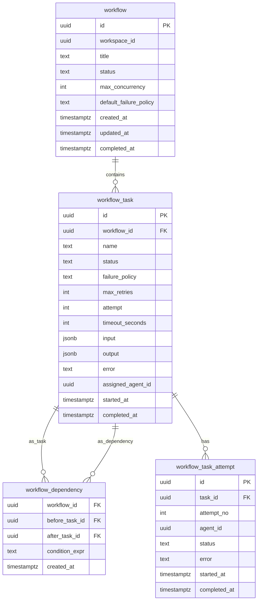
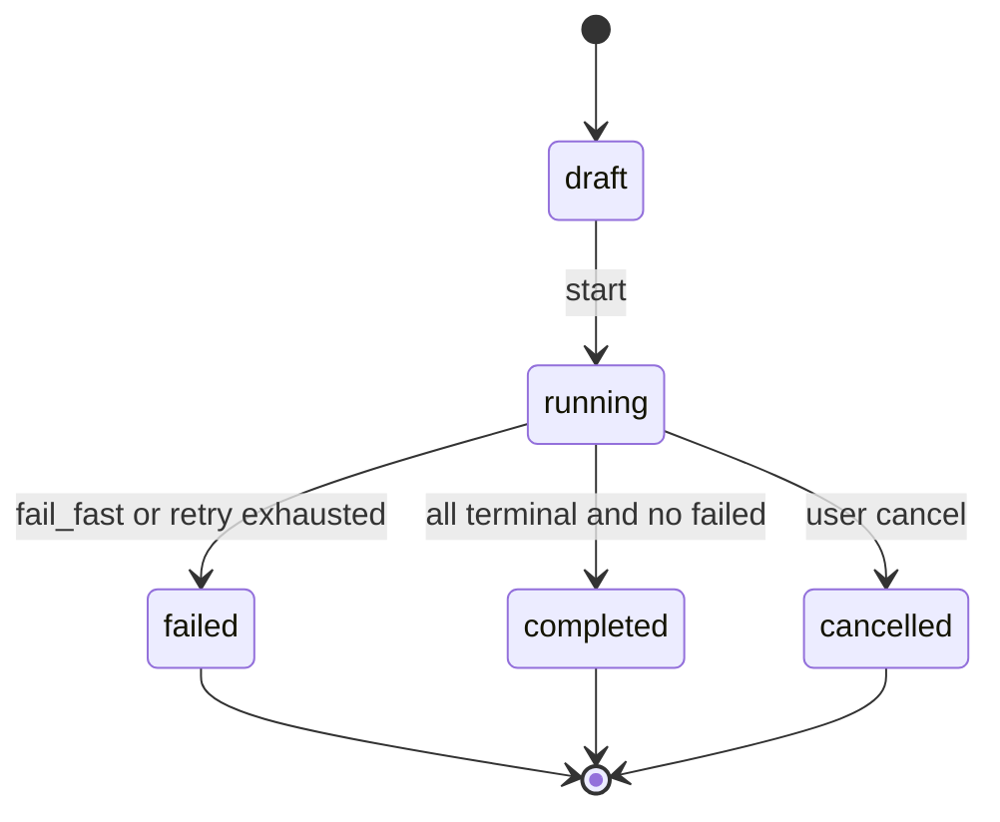
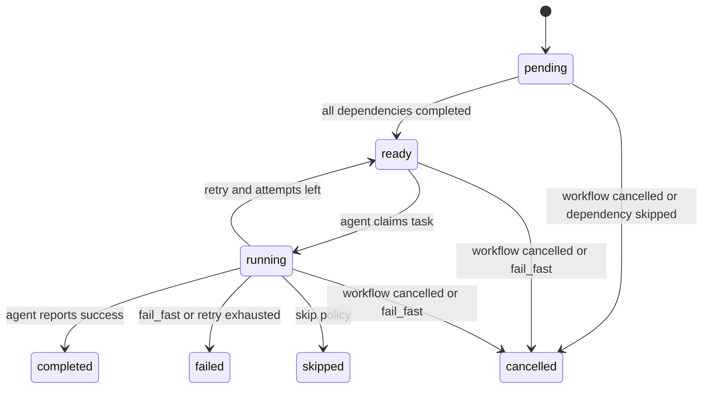

# 任务二：多 Agent 任务编排引擎设计文档

## 1. 目标与边界

本设计面向 Multica 的 Squad 场景：Leader Agent 将复杂需求拆成多个子任务后，系统不再把子任务视为完全独立的队列项，而是把它们组织成一个有依赖关系的 Workflow。编排引擎负责维护 DAG、判断可执行任务、控制并发、处理失败策略，并保证多个 Agent 并发领取任务时不会重复分配。

本次核心实现位于 `task2/src/`，采用内存数据结构模拟数据库，重点展示调度算法和状态机。生产环境落地时应使用 PostgreSQL 表、事务和行级锁替代内存对象。

## 2. 数据模型

### 2.1 ER 图



### 2.2 字段说明

- `workflow.status`：编排整体状态，控制是否允许继续调度。
- `workflow.max_concurrency`：全局并发上限，避免 Leader 一次性派发过多 Agent 任务。
- `workflow_task.status`：单个任务状态，驱动调度和 UI 展示。
- `workflow_task.failure_policy`：任务级失败策略，支持 `fail_fast`、`retry`、`skip`。
- `workflow_task.max_retries` / `attempt`：重试上限和已尝试次数。
- `workflow_dependency.condition_expr`：高级能力预留字段，任务完成后可根据输出决定是否激活某条依赖边。
- `workflow_task_attempt`：记录每次执行尝试，便于审计、重试和 Agent 运行日志关联。

## 3. 状态机

### 3.1 Workflow 状态



### 3.2 Task 状态



## 4. 核心算法

### 4.1 DAG 的存储和查询

内存实现中使用两个邻接表：

- `dependencies[task_id] = {前置任务集合}`
- `dependents[task_id] = {后置任务集合}`

数据库实现中对应 `workflow_dependency(before_task_id, after_task_id)`。常用查询：

```sql
-- 查询某任务的前置依赖
SELECT before_task_id FROM workflow_dependency WHERE after_task_id = $1;

-- 查询某任务的后继任务
SELECT after_task_id FROM workflow_dependency WHERE before_task_id = $1;
```

### 4.2 判断前置依赖是否全部完成

算法描述：

1. 找到 `workflow_dependency.after_task_id = 当前任务` 的所有前置任务。
2. 查询这些前置任务的状态。
3. 若所有前置任务均为 `completed`，且当前任务为 `pending`，则可转为 `ready`。
4. 如果前置任务被 `skipped` 或 `failed`，则根据业务策略决定当前任务是否取消、跳过或等待条件分支。

核心实现见 `WorkflowEngine._deps_completed()` 和 `_refresh_ready_tasks()`。

### 4.3 循环依赖检测

使用 Kahn 拓扑排序：

1. 统计所有任务入度。
2. 将入度为 0 的任务放入队列。
3. 不断弹出队列并降低后继任务入度。
4. 若最终访问节点数量小于任务数量，说明存在环。

核心实现见 `WorkflowEngine.detect_cycle()`。

## 5. API 设计

```http
POST /api/workflows
```

创建编排。请求体包含任务列表、依赖边、并发上限和默认失败策略。

```http
GET /api/workflows/{workflow_id}
```

查询编排状态，返回任务节点、依赖边、当前运行任务和失败原因。

```http
POST /api/workflows/{workflow_id}/start
```

校验 DAG 无环后启动编排。

```http
POST /api/workflows/{workflow_id}/claim
```

Agent 领取一个可执行任务。服务端在事务中选择 `ready` 任务并更新为 `running`。

```http
POST /api/workflow-tasks/{task_id}/complete
POST /api/workflow-tasks/{task_id}/fail
```

Agent 上报任务完成或失败，服务端触发后继任务调度与失败策略。

```http
POST /api/workflows/{workflow_id}/cancel
```

取消整个编排，所有非终态任务转为 `cancelled`。

## 6. 并发与一致性

### 6.1 多 Agent 同时领取任务

生产环境推荐使用 PostgreSQL 行级锁：

```sql
WITH candidate AS (
  SELECT id
  FROM workflow_task
  WHERE workflow_id = $1
    AND status = 'ready'
  ORDER BY priority DESC, created_at ASC
  LIMIT 1
  FOR UPDATE SKIP LOCKED
)
UPDATE workflow_task t
SET status = 'running',
    assigned_agent_id = $2,
    started_at = now(),
    attempt = attempt + 1
FROM candidate c
WHERE t.id = c.id
RETURNING t.*;
```

这个方案与 Multica 当前 `ClaimAgentTask` 的做法一致：用单条 `UPDATE ... WHERE id = (SELECT ... FOR UPDATE SKIP LOCKED)` 完成选择和状态转移，避免两个 Agent 领取同一任务。

### 6.2 状态变更原子性

任务完成时应在一个事务内完成：

1. 将当前任务从 `running` 更新为 `completed`。
2. 查询依赖当前任务的后继任务。
3. 对所有依赖已完成的后继任务更新为 `ready`。
4. 如果所有任务终态，更新 workflow 为 `completed`。

失败处理也必须事务化：失败任务状态、重试任务、后继取消、workflow 失败状态要么全部成功，要么全部回滚。

## 7. 失败策略

- `fail_fast`：当前任务失败后，workflow 转为 `failed`，所有 `pending/ready/running` 任务转为 `cancelled`。
- `retry`：如果 `attempt <= max_retries`，任务回到 `ready` 等待再次领取；超过后升级为 `fail_fast`。
- `skip`：当前任务标为 `skipped`。依赖它的后继任务无法满足“前置全部 completed”，因此被取消；不依赖它的其他分支继续执行。

## 8. 崩溃恢复

服务重启后可通过数据库恢复状态：

1. 读取 `workflow.status in ('running')` 的编排。
2. 将超过 `timeout_seconds` 的 `running` 任务标记为失败并应用失败策略。
3. 对 `pending` 任务重新计算依赖完成情况，转移为 `ready`。
4. 对 `ready` 任务等待 Agent 再次领取。

## 9. Trade-off 分析

### 9.1 用边表存 DAG，而不是 JSON 存依赖

选择边表 `workflow_dependency` 的原因是查询前置/后继任务更直接，也能用唯一索引防止重复依赖。JSON 存储虽然写入简单，但难以做事务内锁定、循环检测和依赖查询优化。

### 9.2 使用数据库锁调度，而不是应用层全局锁

应用层锁在单实例下简单，但多后端实例部署时会失效。PostgreSQL `FOR UPDATE SKIP LOCKED` 可以直接把并发控制放在数据源头，和 Multica 现有任务领取机制一致，更适合水平扩展。

### 9.3 `skip` 不等于把后继任务视为成功

如果一个后继任务依赖被 skip 的任务，默认应取消，而不是继续执行。这样更符合 DAG 的语义：依赖表示必须拿到前置输出。若业务需要“失败也继续”，可以通过条件边或显式配置 `allow_skipped_dependency` 扩展。

## 10. 核心实现说明

核心代码见：

- `task2/src/workflow_engine.py`
- `task2/src/test_workflow_engine.py`

运行测试：

```bash
python -m unittest discover -s task2/src -p "test_*.py"
```

当前测试覆盖：

- 简单线性依赖：A → B → C
- 并行执行：A → [B, C] → D
- 菱形依赖：A → [B, C] → D
- 循环依赖检测：A → B → C → A
- 失败策略：`fail_fast`、`retry`、`skip`
- 并发限制：10 个无依赖任务，限制并发为 3

